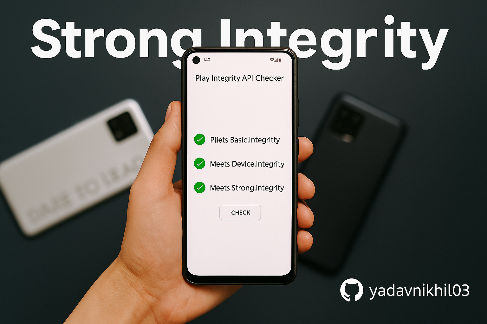

# 🔐 Play Integrity Fix Guide

**Pass Basic, Device & Strong Integrity on Rooted or Custom ROM Android**

*Comprehensive guide for Magisk, KernelSU, Android 13+ Recommended*

## 📋 Overview

This repository provides a **complete, tested, and up-to-date guide** to help you pass all levels of **Google Play Integrity API** (Basic, Device & Strong) on rooted and custom ROM devices.

### What you'll achieve:
✅ **Basic Integrity** - Pass basic device checks  
✅ **Device Integrity** - Pass hardware attestation  
✅ **Strong Integrity** - Pass the highest security level  

### Who is this for?
- Users with **rooted** Android devices (Magisk/KernelSU)  
- **Custom ROM** users who need Play Integrity

---

## 🚀 Main Guide

### [📖 **ACCESS FULL STEP-BY-STEP GUIDE** →](guide/full_guide.md)

*Complete walkthrough with tools, methods, and troubleshooting*

---

## ⚠️ Important Disclaimer

**This guide is provided as-is for educational purposes only.**

- You are solely responsible for how you use the information and modules referenced in this repository
- Module behavior, compatibility, and results may vary depending on your device, ROM, kernel, and root method  
- We do **not own** or maintain the third-party modules linked in this guide (e.g., Play Integrity Fix, TrickyStore, etc.)
- This guide does not guarantee the success of any fix and is not liable for any misuse, damage, or software violations

> 🧠 **Use this guide and any included tools at your own risk.** If something breaks — you own it, not us.

---

<strong>❓ Frequently Asked Questions</strong>

### General Questions

**Q: Does this work on Android 14/15?**  
A: Yes — verified on Android 13, 14 & 15 with both Magisk and KernelSU. Android 13+ recommended for best results.

**Q: What devices are supported?**  
A: Most Android devices running Android 13+ with Magisk or KernelSU root access.

**Q: Will this affect my device warranty?**  
A: Rooting and modifying your device typically voids warranty. Proceed at your own risk.

### Compatibility Questions

**Q: Can I use this with banking apps?**  
A: Yes, this guide specifically helps bypass Play Integrity checks used by banking and payment apps.

**Q: Will this work with my custom ROM?**  
A: Yes, the guide covers methods for popular custom ROMs including LineageOS, Pixel Experience, and others.

**Q: Do I need specific modules?**  
A: Yes, you'll need Play Integrity Fix and TrickyStore modules. The guide explains installation.

### Troubleshooting

**Q: What if my integrity still fails?**  
A: The guide includes comprehensive troubleshooting steps and alternative methods.

**Q: Is this safe for my device?**  
A: When followed correctly, yes. However, any modifications carry inherent risks.

<strong>🙏 Credits & Acknowledgments</strong>

### Open Source Community

This guide utilizes various open-source modules and tools developed by the Android modding community. We acknowledge and thank all the developers and contributors who make these tools possible. ❤️

### Resources & Tools:
- Various XDA developers and researchers
- GitHub open source community
- Android security researchers
- Beta testers and early adopters

> 📄 **License:** This project is licensed under the [MIT License](LICENSE). All third-party modules retain their original licenses and credits.

### Contributing
We welcome contributions to improve this guide. Feel free to submit issues, suggestions, or pull requests to help make this resource better for everyone.

---

## 🌟 Support This Project

<a href="https://github.com/yadavnikhil03/Play-integrity-fix-guide" target="_blank">
  ⭐ <strong>Star this repo</strong>
</a>
&nbsp;•&nbsp;
<a href="https://github.com/yadavnikhil03/Play-integrity-fix-guide/issues" target="_blank">
  🐛 <strong>Report issues</strong>
</a>

