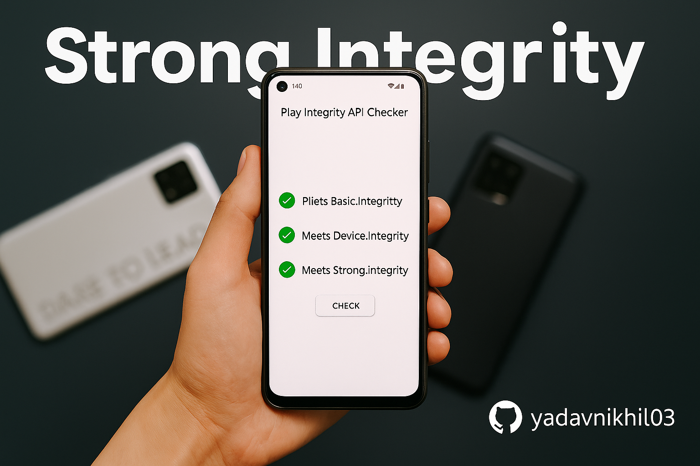

# 🔐 Play Integrity Fix Guide

**Fix Play Integrity on Rooted & Custom ROM Android**

*Complete guide with multiple methods for all root solutions*

## 📋 Overview

This repository provides a **tested, comprehensive guide** to restore **Google Play Integrity** on rooted and custom ROM Android devices. Whether you use Magisk, KernelSU, or any other root solution, you'll find methods that work.

### 🎯 What You'll Get:
- ✅ **Working banking & payment apps** - No more integrity rejection errors  
- ✅ **Gaming without hassles** - Play demanding games on modified devices  
- ✅ **Multiple solutions** - Different methods for different scenarios  
- ✅ **Real-world tested** - Methods verified on Android 13, 14 & 15  

**The reality:** Most apps only need 2 out of 3 integrity checks. Your focus should be on making banking, payment, and gaming apps work — which this guide delivers.

### 📱 Who is this for?
- Any user with a **rooted device** (Magisk, KernelSU, SuperSU, or other root methods)  
- **Custom ROM** users facing Play Integrity blocks  
- Users who need **banking/payment apps** to work on modified devices  
- **Gamers** who want full compatibility with protected apps

---

## 🚀 Choose Your Method

### [📖 **VIEW ALL SOLUTIONS** →](guide/full_guide.md)

4 proven methods • Step-by-step guides • Full troubleshooting support

### 📋 What's Inside:
- **IntegrityBox** - Works with most devices, root required
- **YuriKey** - Simplest setup, minimal configuration  
- **Keybox.xml** - For non-rooted custom ROMs  
- **TrickyStore Advanced** - When other methods don't work

---

## ⚠️ Important Disclaimer

**This guide is provided as-is for educational purposes only.**

- You are solely responsible for how you use the information and modules referenced in this repository
- Module behavior, compatibility, and results may vary depending on your device, ROM, kernel, and root method  
- We do **not own** or maintain the third-party modules linked in this guide (e.g., Play Integrity Fix, TrickyStore, etc.)
- This guide does not guarantee the success of any fix and is not liable for any misuse, damage, or software violations

> 🧠 **Use this guide and any included tools at your own risk.** If something breaks — you own it, not us.

---

<strong>FAQ</strong>

**Device compatibility?**  
Android 13+ on any device with Magisk, KernelSU, SuperSU, or similar root access. Custom ROMs work too.

**Will this work for me (banking, gaming, etc)?**  
Probably yes. The 4 methods cover most situations. If one doesn't work, try the next.

**Do I lose my warranty?**  
Yes, rooting typically voids it.

**Does this require all 3 integrity checks?**  
No. Most apps run fine with 2 checks passing. Just test your actual apps—if they work, you're good.

**What if my apps still don't work?**  
The full guide has troubleshooting steps. If that fails, try a different method (especially TrickyStore).

<strong>🙏 Credits & Acknowledgments</strong>

### Open Source Community

This guide utilizes various open-source modules and tools developed by the Android modding community. We acknowledge and thank all the developers and contributors who make these tools possible. ❤️

### Resources & Tools:
- Various XDA developers and researchers
- GitHub open source community
- Android security researchers
- Beta testers and early adopters

> 📄 **License:** This project is licensed under the [MIT License](LICENSE). All third-party modules retain their original licenses and credits.

### Contributing
We welcome contributions to improve this guide. Feel free to submit issues, suggestions, or pull requests to help make this resource better for everyone.

---

## 🌟 Support This Project

<a href="https://github.com/yadavnikhil03/Play-integrity-fix-guide" target="_blank">
  ⭐ <strong>Star this repo</strong>
</a>
&nbsp;•&nbsp;
<a href="https://github.com/yadavnikhil03/Play-integrity-fix-guide/issues" target="_blank">
  🐛 <strong>Report issues</strong>
</a>

