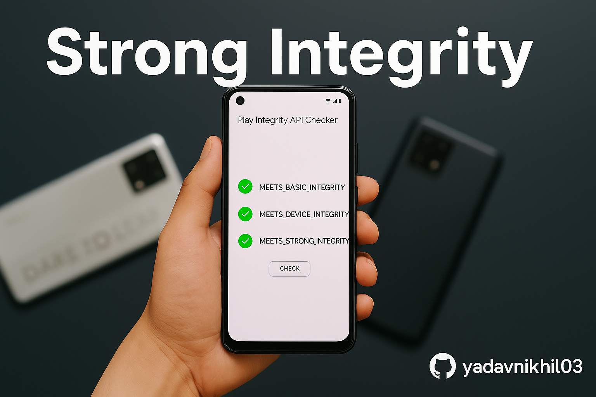

<h1 align="center">🔐 Play Integrity Fix Guide</h1>

  

  <strong>Pass Basic, Device & Strong Integrity on Rooted or Custom ROM Android</strong> 
  <em>Magisk | KernelSU | Android 8+ | Works with GPay, Banking Apps, etc.</em>

  
  
  
  

---

## 📋 Overview

This repository provides a complete, tested, and up-to-date guide to help you pass all levels of **Google Play Integrity API** (Basic, Device & Strong) on rooted and custom ROM devices.

---

## 📘 Full Guide

👉 Click below to access the full step-by-step guide, tools, and troubleshooting:

### [▶️ Read the Full Guide →](guide/full_guide.md)

---

## ❓ FAQ

**Q:** Who is this guide for?  
**A:** Anyone using rooted or custom ROM devices who needs to pass Google Play Integrity for apps like GPay, banking, or games.

**Q:** Does this work on Android 14?  
**A:** Yes — verified on Android 13 & 14 with both Magisk and KernelSU.

---

## ⚠️ Disclaimer

This guide is provided for educational and research purposes only.  
Use at your own risk. You are responsible for how you apply this information.

---

## ⭐ Support

If you find this project helpful, consider giving it a ⭐ to support future updates.
